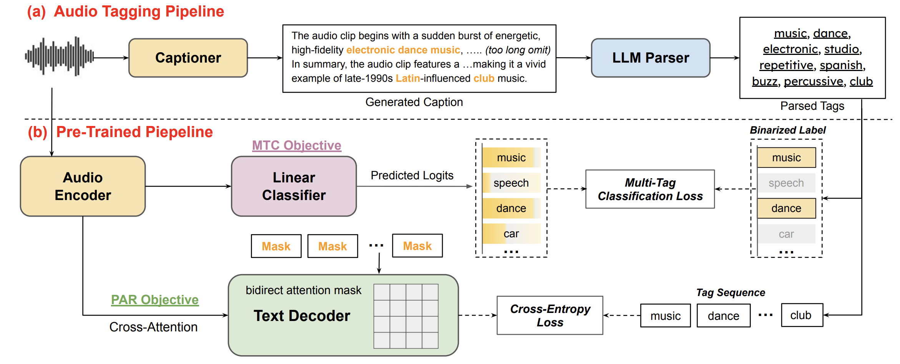

# Unlocking Strong Supervision: A Data-Centric Study of General-Purpose Audio Pre-Training Methods

[](https://huggingface.co/datasets/eureka1500/UTS)

<p>
  
</p>

This example presents UTS, a new data-centric pipeline that leverages a high-fidelity captioner to create SOTA-quality captions and the first Unified Tag System (UTS) that bridges speech, music, and environmental sounds. 
We then conduct a systematic comparative study of different pre-training objectives on these strong source data under the Auden framework. 
Our experiments suggest that data quality and coverage are the primary drivers of performance, while the choice of objective dictates downstream task specialization.


## Installation
In addition to the base Auden framework, this example requires the following packages:

```bash
pip install vllm psutil modelscope
```

requires Python 3.8+, CUDA 11.8+, PyTorch 2.0+ and 1–8 GPUs.


## Tag System Construction Pipeline

`utils` contains the full pipeline for constructing the Unified Tag System (UTS) from raw audio files. The pipeline consists of four steps:

```
Step 1: Audio captioning       (vllm_qwen/)
Step 2: Tag extraction         (extract_tags.py)
Step 3: Build label system     (build_label_system.py)
Step 4: Filter by vocabulary   (filter_tags.py)
```


### Step 1

Edit the config block at the top of `vllm_qwen/run.sh` (model path, input file, output dir), then:
```bash
cd utils/vllm
bash run.sh     # start

bash stop.sh    # stop
```

Input: a `.scp` file where each line is 
```
{"idx": ..., "path": ...}
```
Output: one `.json` file per clip saved to `OUT_DIR/`, with an added `caption` field.

Key parameters in `run.sh`:

| Parameter | Description | Recommendation |
|-----------|-------------|----------------|
| `NUM_WORKERS` | CPU worker processes | `CPU cores × 2–3` |
| `QUEUE_MAX` | Shared queue size | `MAX_SEQS × 256–512` |
| `MAX_SEQS` | Max concurrent GPU sequences | 8 (40GB), 16 (80GB) |


### Steps 2–4

Edit the config block at the top of `run_tag_pipeline.sh`, then:
```bash
bash run_tag_pipeline.sh
```

This runs tag extraction (Qwen2.5-7B-Instruct), TF-IDF label system construction, and per-vocabulary filtering in sequence. Vocabulary sizes default to 800 / 1k / 1.5k / 2k / 3k. Based on our experiments, **K = 1500–2000** is the recommended sweet spot for a 400k-scale dataset.


## Data

The dataset is available at a huggingface repo [eureka1500/UTS](https://huggingface.co/datasets/eureka1500/UTS). It contains ~361k training samples from [CaptionStew](https://arxiv.org/abs/2511.16757) 400K-subset, spanning speech, music, and environmental sounds.
Each sample includes a high-fidelity caption and UTS tags constructed using the pipeline above. 

The `cut.recording.sources[0].source` field stores the source dataset name (e.g., `audioset`) - replace this with your local audio path before training.

The `configs/label` folder contains UTS vocabularies at five sizes (800 / 1k / 1.5k / 2k / 3k), selected by TF-IDF over all parsed tags.


## Citation

If you use UTS in your research, please cite:

```bibtex
@article{zhou2026uts,
  title={Unlocking Strong Supervision: A Data-Centric Study of General-Purpose Audio Pre-Training Methods},
  author={Zhou, Xuanru and Shao, Yiwen and Tseng, Wei-Cheng and Yu, Dong},
  journal={In Proceedings of the IEEE/CVF Conference on Computer Vision and Pattern Recognition (CVPR), 2026},
  year={2026}
}
```


